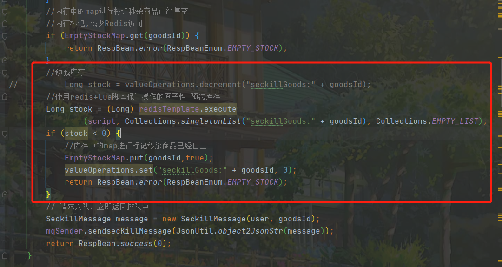
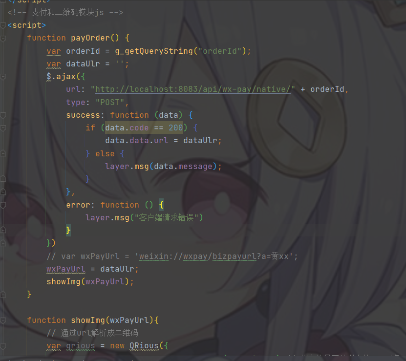
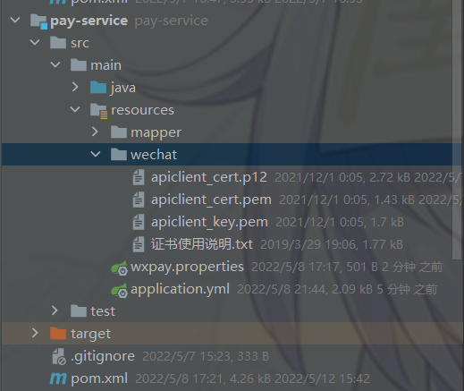
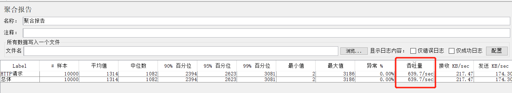
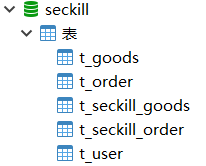
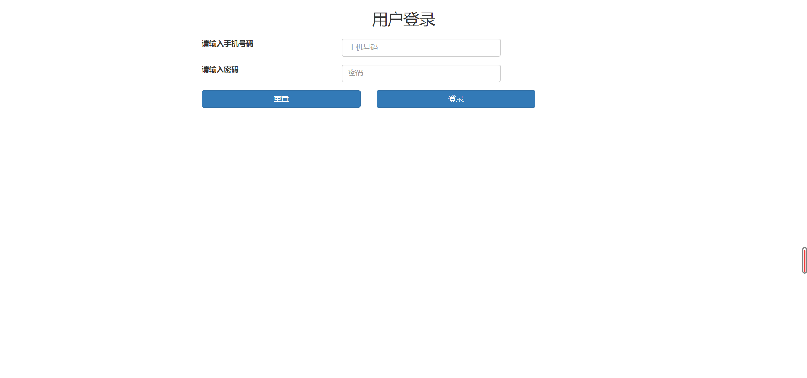
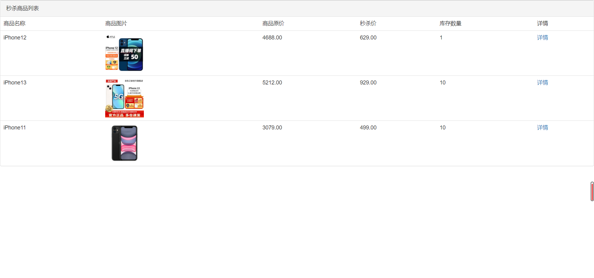
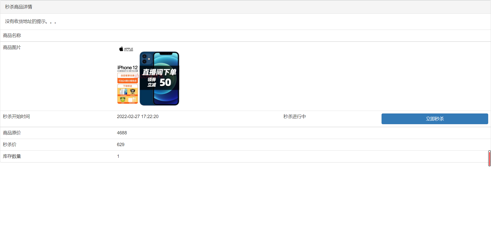
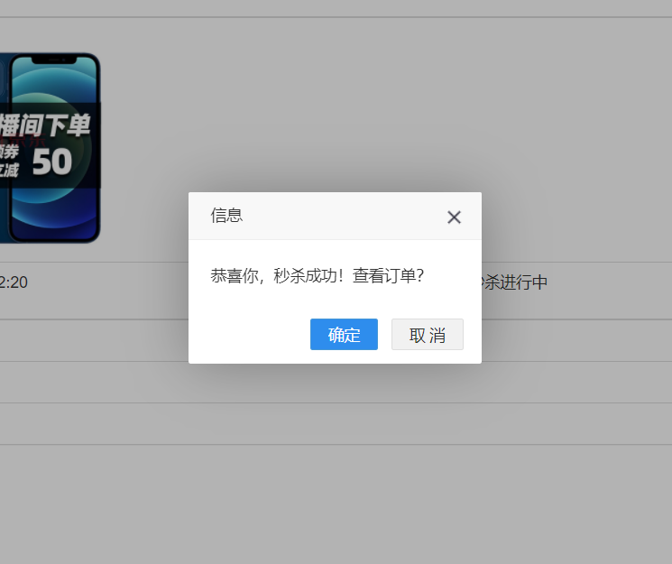
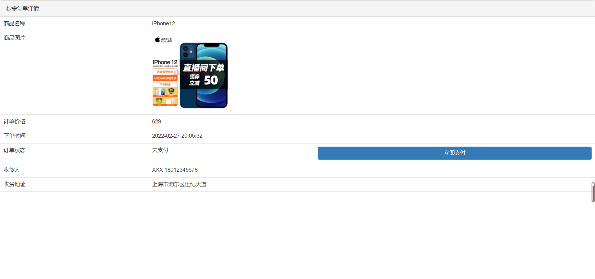

# My-seckill
 简单秒杀和支付demo，~~不考虑集群/微服务~~（已升级重构为简单使用Spring Cloud Alibaba）

~~前后端不分离，只是单纯的在界面请求接口，使用thymeleaf模板引擎 + jquery-validation  + ajax + js + bootsrap~~（重构后，还没成功用Vue.js重写前端项目，目前还只是用Spring Boot项目静态资源展示）

## 项目技术

后端技术：Spring Boot + Spring Cloud Alibaba +  Mybatis-Plus + MySQL + Redis + RabbitMQ

测压工具：apache-jmeter-5.4.3

其中选用网关Gateway，注册中心Nacos，远程调用Open Feign，支付组件wechatpay-apache-httpclient

## 项目描述

- [x] 使用网关 **Gateway** 和注册中心 **Nacos** 进行转发路由到具体模块
- [x] Gateway中配合Redis使用限流 **RequestRateLimiter** (自定义令牌桶规则是主机名)
- [x] 预热秒杀商品基本信息，防止缓存击穿
- [x] 使用 **RabbitMQ** 异步操作，流量削峰，设置队列和交换机持久化
- [x] 采用确认和回退机制，把提交失败的信息存入数据库错误表中~~后期可以考虑用定时任务处理~~
- [x] **Redis + Lua **脚本保证原子性~~（但由于把LUA脚本放在在Java端所以每次都会把该脚本发送给Redis故导致吞吐量降低）~~
- [x] 当秒杀商品为0时，用内存中的变量标识，反之无效的再次访问Redis
- [x] 自定义注解拦截器，计数器方法和令牌桶算法，两种接口限流
- [x] 微信支付Native方式（弹出二维码扫支付），回调确认支付成功，~~支持查单退单~~
- [x] 内网穿透 **ngrok**（微信支付成功后，由微信平台主动发出回调请求，需要找到公网的地址）
- [x] Mybatis-Plus操作数据库MySQL的InnoDB引擎执行SQL语句，且同时把用户id + 商品id设置为唯一索引
- [x] 秒杀接口隐藏，定点修改界面JS
- [x] hutool工具验证码
- [x] rabbitmq延迟队列定时30分钟取消未支付的订单 
- [ ] 页面静态化 + 部分对象静态化处理降低网络拥塞 ~~（也可以考虑使用CDN）~~


## 项目模块

cloud-seckill-demo ——  公共模块，存放exception包和utils包

gateway ——  网关，端口8083

seckill-provide ——  秒杀模块，端口8084，并且在resources/static和resources/templates下存在前端资源（后期可升级为前后端分离）

seckill-consumer ——  秒杀模块，端口8184

good-service ——  商品模块，端口8085

pay-service ——  支付模块，端口8086

user-service ——  用户模块，端口8087


## 项目部分图解

秒杀下单的关键代码如下图：



前端采用 jquery 和 bootstrap，并且导入 qrious.js 解析工具二维码

```html
<!-- jquery -->
<script type="text/javascript" src="/js/jquery.min.js"></script>
<!-- bootstrap -->
<link rel="stylesheet" type="text/css" href="/bootstrap/css/bootstrap.min.css"/>
<script type="text/javascript" src="/bootstrap/js/bootstrap.min.js"></script>
<!-- layer -->
<script type="text/javascript" src="/layer/layer.js"></script>
<!-- common.js -->
<script type="text/javascript" src="/js/common.js"></script>
<!-- qrious.js 二维码生成工具 -->
<script src="https://cdn.bootcdn.net/ajax/libs/qrious/4.0.2/qrious.js"></script>
```



微信支付模块的SDK选择

可以选官网支持的`wechatpay-apache-httpclient`需要手动发送Http请求Util类

也可以选择第三方Maven仓库封装好的组件`payment-spring-boot-starter`

有兴趣可自行搜索官方文档：https://pay.weixin.qq.com/wiki/doc/apiv3/wxpay/pages/index.shtml

```xml
<!--        &lt;!&ndash; 微信/支付宝支付 &ndash;&gt;-->
<!--        <dependency>-->
<!--            <groupId>cn.felord</groupId>-->
<!--            <artifactId>payment-spring-boot-starter</artifactId>-->
<!--            <version>1.0.12.RELEASE</version>-->
<!--        </dependency>-->
	<!--微信官方支持的支付SDK-->
    <dependency>
        <groupId>com.github.wechatpay-apiv3</groupId>
        <artifactId>wechatpay-apache-httpclient</artifactId>
        <version>0.3.0</version>
	</dependency>
```

注意，若想真实模拟微信支付场景，需要注册和认证商家号，获得对应的证书，且须知微信平台会对支付收起相应的服务费




内网穿透工具 **ngrok.io**，每次启动都会重新刷新地址，故都需要在 **wxpay.propertis** 中修改 **wxpay.notify-domain**

官网下载地址：https://ngrok.com/download

```properties
  # 微信服务器地址
wxpay.domain=https://api.mch.weixin.qq.com
  # 接收结果通知地址
wxpay.notify-domain=https://7d92-115-171-63-135.ngrok.io
```


使用jmeter测试当前情况下秒杀商品，设置线程组为1000线程数，循环10次




数据库分表情况




页面效果展示

登录界面



商品列表界面



商品详情界面



成功秒杀后进入商品订单界面






点击"立即支付"按钮，机会弹出响应二维码，再次点击二维码图片即可消失


